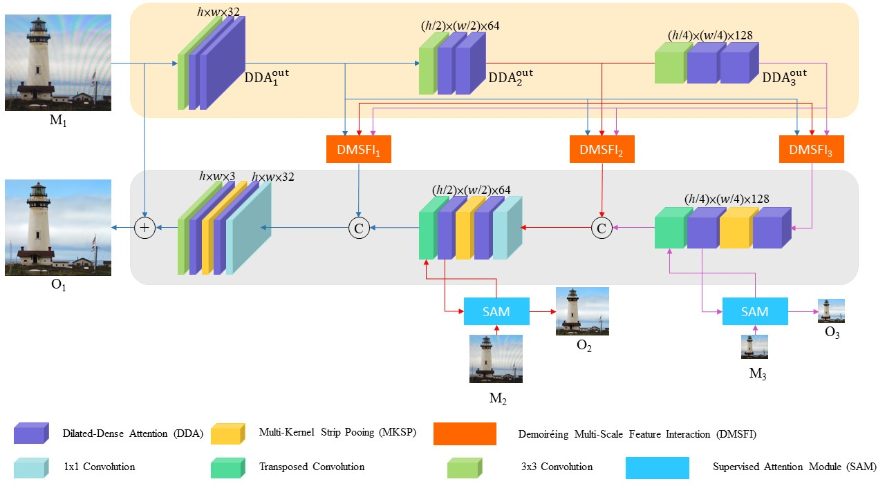

# Image Demoireing using Multi-scale Fusion Networks (DMSFN)
[]()
[]()


> **Abstract:** 
*Taking images on a digital display may cause a visually-annoying optical effect, called moiré, which degrades image visual quality. In this paper, we propose an Image Demoiréing Multi-scale Fusion network (DMSFN) to remove Moiré patterns and a method for data augmentation using the transfer of Moiré patterns, which can enhance the performance of demoiréing. According to the experimental results, our model performs favorably against state-of-the-art demoiréing methods on benchmark datasets.* 


## Network Architecture of DMSFN



## Environment

- Windows 10 
- GeForce RTX 3090 GPU
- python3.8.6
- torch=1.8.1
- torchvision=0.9.1 

## Installation

1. Install virtual environment:
	```shell
	virtualenv -p python3 exp2 # establish
	.\exp2\Scripts\activate # activate 
	```

2. Clone this repo:
	```shell
	git clone https://github.com/josephhou626/jopseph_thesis.git # clone
	```

3. Install torch and torchvision:
	```shell
	pip3 install torch==1.8.1+cu111 torchvision==0.9.1+cu111 torchaudio===0.8.1 -f https://download.pytorch.org/whl/torch_stable.html
	```

4. Install dependencies:
   ```shell
   pip install -r requirements.txt
   ```
   
## Data preparation

### TIP18 Dataset
- Author of this dataset : "[Moiré Photo Restoration Using Multiresolution Convolutional Neural Networks](https://arxiv.org/abs/1805.02996)"
- Download "[TIP18](https://drive.google.com/drive/folders/109cAIZ0ffKLt34P7hOMKUO14j3gww2UC)" dataset into './datasets' </br>
- For example: './datasets/TIP18'

```
./datasets/TIP18
+--- trainData
|   +--- source
|   +--- target
|
+--- TestData
|   +--- source
|   +--- target
```

**Prepossessing  TIP18 Dataset** </br>
- First of all, we will crop the images of the TIP18 dataset to 256*256 resolution to train and test model. 

To generate train data: 
```
python prepossessing.py --data_clear_path datasets/TIP18/trainData/target --data_moire_path datasets/TIP18/trainData/source --save_dir_name TrainData
```
To generate test data:
```
python prepossessing.py --data_clear_path datasets/TIP18/testData/target --data_moire_path datasets/TIP18/testData/source --save_dir_name TestData
```

### FHDMi Dataset
- Author of this dataset : "[FHDe2Net: Full High Definition Demoireing Network](https://github.com/PKU-IMRE/FHDe2Net)"
- Download "[FHDMi](https://drive.google.com/drive/folders/1IJSeBXepXFpNAvL5OyZ2Y1yu4KPvDxN5)" dataset into './datasets' </br>
- For example: './datasets/FHDMi'


### LCDMoire Dataset
- Author of this dataset : "[AIM 2019 Demoireing Challenge - Track 1: Fidelity](https://competitions.codalab.org/competitions/20165)"
- Download from "[LCDMoire](https://competitions.codalab.org/competitions/20165)" dataset into './datasets' </br>
- For example: './datasets/LCDMoire'


## Data augmentation for  Moiré patterns
- The implementation is modified from "[Explore Image Deblurring via Encoded Blur Kernel Space](https://github.com/VinAIResearch/blur-kernel-space-exploring)"
- cd './AUG'

## Training for Data augmentation

```
python DA_train.py
```

## Generating for Data augmentation
- For reproducing our results on TIP18 datasets, download "[DA_weight.pth](https://drive.google.com/file/d/1oWk4OHYwtHz52GkGaA8t8fVxIl5Vtv_u/view?usp=sharing)" </br>
- Put the DA_wight.pth into 'experiments/TIP2018_AUG/models'. </br>
- For example: 'AUG/experiments/TIP2018_AUG/models/DA_wight.pth' </br>

```
python DA_test.py --num_images 10
```


## Examples of Data augmentation

- We can select a $Source Moiré$ image and its corresponding $Source GT$ ground-truth image and a clean image $Target GT$.
- We transfer the Moiré patterns of $Source Moiré$ to $Target GT$ to get $Target Moiré$.
- We can use $Target Moiré$ to do data augmentation.


## Training for DMSFN
- Download TIP18 dataset
- For perceptual loss , download "[VGG19.pth](https://drive.google.com/file/d/1DcDARBfvK7EczDblnILwqh-NteHn3aBb/view?usp=sharing)"
- Put the VGG19.pth into 'vgg_models'.
- For example: 'vgg_models/VGG19.pth'

**For Data augmentation on TIP18 dataset** </br>
1. We used 15% of the TIP18 dataset for data augmentation, resulting in 11,768 images of $Target Moiré$.

2. Run the following command for Generating $Target Moiré$:
```
cd .\AUG
python DA_test.py --num_images 11768
```

3. Put $Target Moiré$ and $Target GT$ into TIP18 training set.

4. Run the following command for training :
```
python train_TIP18.py --data_clear_path datasets/TIP18_crop/TrainData/target --data_moire_path datasets/TIP18_crop/TrainData/source --save_model_path checkpoints/TIP18/DMSFN_plus
```

## Testing for DMSFN

**For testing on TIP18 dataset** </br>
- Download TIP18 dataset
- For reproducing our results on TIP2018 datasets, download "[TIP_AUG_DMSFN_plus.pth](https://drive.google.com/file/d/1e_BVrk98zxS8Z06B09QoUhAwBPjtMnLC/view?usp=sharing)"
- Put the TIP_DMSFN_plus.pth into 'checkpoints/TIP18/DMSFN_plus'.
- For example: 'checkpoints/TIP18/DMSFN_plus/TIP_AUG_DMSFN_plus.pth'


Run the following command for testing :
```
python predict_TIP18.py --data_clear_path datasets/TIP18_crop/TestData/target --data_moire_path datasets/TIP18_crop/TestData/source --load_model_path checkpoints/TIP18/DMSFN_plus/TIP_DMSFN_plus --save_results_name DMSFN_plus
```

**For testing on FHDMi dataset** </br>
- Download FHDMi dataset
- For reproducing our results on FHDMi datasets, download "[FHDMi_DMSFN_plus.pth](https://drive.google.com/file/d/1KFyt6bcxOscheiHYYpab1LKFWh9g6BIa/view?usp=sharing)"
- Put the FHDMi_DMSFN_plus.pth into 'checkpoints/FHDMi/DMSFN_plus'.
- For example: 'checkpoints/FHDMi/DMSFN_plus/FHDMi_DMSFN_plus.pth'

Run the following command for testing :
```
python predict_FHDMi.py --data_clear_path datasets/FHDMi/test/target --data_moire_path datasets/FHDMi/test/source --load_model_path checkpoints/FHDMi/DMSFN_plus/FHDMi_DMSFN_plus --save_results_name DMSFN_plus
```


**For testing on LCDMoire dataset** </br>
- Download LCDMoire dataset
- For reproducing our results on LCDMoire datasets, download "[LCDMoire_DMSFN_plus.pth](https://drive.google.com/file/d/1lr3IiNbkbSfAOsQRclJDQWrTAJ5U92ub/view?usp=sharing)"
- Put the LCDMoire_DMSFN_plus.pth into 'checkpoints/LCDMoire/DMSFN_plus'.
- For example: 'checkpoints/LCDMoire/DMSFN_plus/LCDMoire_DMSFN_plus.pth'

Run the following command for testing :
```
python predict_LCDMoire.py --data_clear_path datasets/LCDmoire/valid/clear --data_moire_path datasets/LCDmoire/valid/moire --load_model_path checkpoints/LCDMoire/DMSFN_plus/LCDMoire_DMSFN_plus --save_results_name DMSFN_plus
```


## Demoireing Results 


## Evaluation

* For evaluation on TIP18 results in MATLAB, download "[TIP18_DMSFN_plus_results](https://drive.google.com/file/d/1BnY7HYWwMhpDUq5-xO8Si34lWyy0CqAK/view?usp=sharing)" into './results/TIP18/DMSFN_plus/output'

```
evaluation_TIP18.m
```

* For evaluation on FHDMi results in MATLAB, download "[FHDMi_DMSFN_plus_results](https://drive.google.com/file/d/1mbprYuIKzHAadGJe1ibExF5BETo4yj1E/view?usp=sharing)" into './results/FHDMi/DMSFN_plus/output'

```
evaluation_FHDMi.m
```
* For evaluation on LCDMoire results in MATLAB, download "[LCDMoire_DMSFN_plus_results](https://drive.google.com/file/d/1gVnzeQFIM4tjuJtA-xA6rjKipbnJjNWU/view?usp=sharing)" into './results/LCDMoire/DMSFN_plus/output'

```
evaluation_LCDMoire.m
```

## Citation
```

TODO


```
